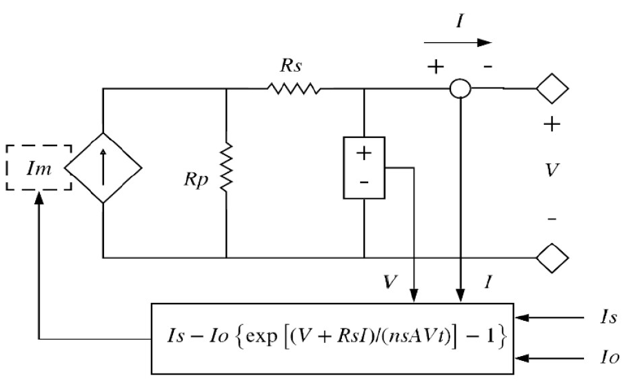
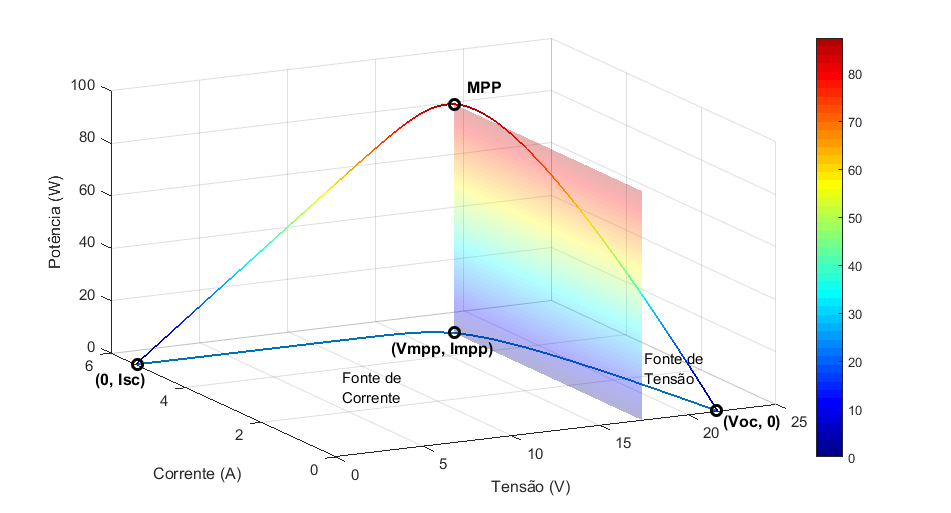

# Photovoltaic Array Modeling Using Simulink

This Simulink block diagram allows the user to simulate a photovoltaic array behavior based on temperature, solar irradiation, and electrical circuit constraints.

It's possible to obtain graphics for I-V (current versus voltage) and P-V (power versus voltage) curves. For your first test, you can use data from the two photovoltaic panels provided, and it's also possible to use data from other panels given the .dat model file. 

This project used the following (one-diode) circuit representation of a photovoltaic array. 

3D P-V and I-V graphics representation. 

